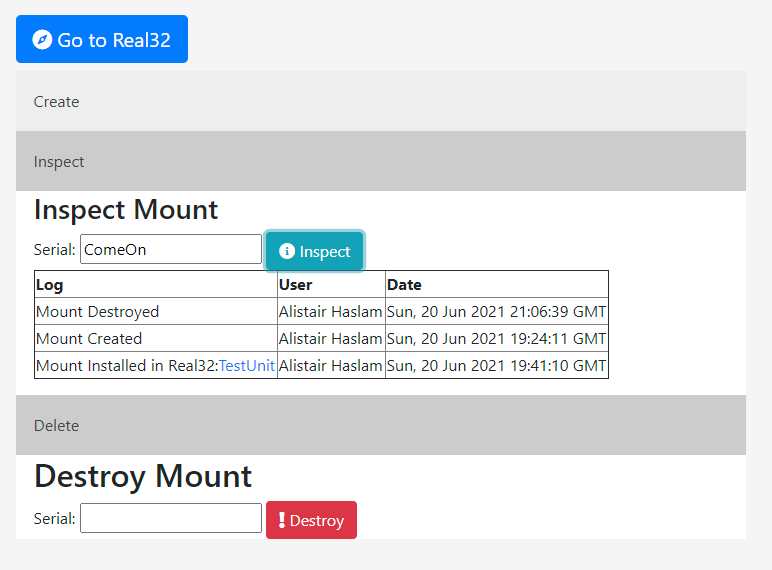

# Real32Tracker (The Sage killer!)

This project is v.Jank right now but here it is.
Import the code using 'Import Maven Project' in eclipse. Run Maven Install and then run the project (should start as a Spring project).
Project broadcasts on localhost:8090 and uses a H2 embedded database which will not interfere with anything else.

What you can do.

##Create a mount

Go to mounts, then create and type in a serial. This will redirect you to the homepage.

##Create a Real32 unit

Go to Real32. Enter a Serial no. for the new Unit. Select the Mounts created from the dropdowns.

## Search Real32 Unit

In Real32 type in the Serial number and click search. Will pop up with When it was created, by who and which mounts are installed.

## Inspect mount
In the mounts menu. Select Inspect and type in the mount. The logs for when it was created and which Real32 it has been installed in will be shown.

Still v.shakey and lots to fiddle with, not going to get used due to sage but...

1. Cheaper than Sage.
2. More accessible than Sage.
3. Just as secure as Sage (Passwords are encrypted using Spring Security).
4. Works in any browser, and due to security can be accessed off site.
5. Cooler than Sage. Good practice for me.
6. 3D Rendering Baby! Sage can't do that!

Based off: Spring Boot Tutorial: Create Java Login Web App using Spring Security and Eclipse

This source code is part of [Create Java Login Web App using Spring Security and Eclipse](https://www.djamware.com/post/5e32d450ad84a94e7885bbf9/spring-boot-tutorial-create-java-login-web-app-using-spring-security-and-eclipse) tutorial.
